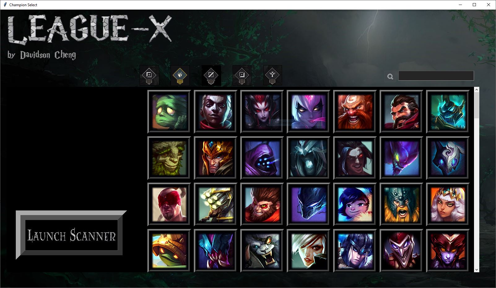

# League-X

## Overview

**League-X** is a python application that employs Deep Learning and Image Processing to read the position of enemy champions on the Minimap, thus helping the playing predict where the enemies are.

### Required Dependencies:

Python3

Opencv2

tkinter

tensorflow

keras

## How to use

After you ensured that you have all required dependencies installed, go ahead and clone this repo by "git clone" or "download zip". The file is quite large, around 115mb.

#### Run the Demo

Decompress the file, cd into the "League-X" directory, and run the "DisplayImage.py" script, you should be able to see something like this:

#### Run League-X on live LOL Game

Run the "Champ_Select_GUI.py" file in the project's directory.

You will see a GUI like:

Go ahead and pick the five enemy champions by selecting them on the right panel, you can click the position icon to toggle between the champions at each position, you can also filter the champions by type in their name in the upper-right search bar.

Make sure you are picking the champions on the enemy team, as the enemy champions are the ones we want to keep track of. After you have selected the enemy champions, click launch scanner and follow its direction. 

League-X currently supports 131/149 champions in League of Legends, we will add support to more champions in the future.

After clicking "Launch Scanner", the training should start, it will take between 30 seconds and 5 minutes, depending on what machine you are working with. After the training is complete, you can run the "LiveDisplayImage.py" file to get live tracking of the enemy champions in a live League of Legends game.

In addition: League-X works best when you set your minimap size in LOL to 100% in LOL's settings, because I recorded all the data under that minimap size.
